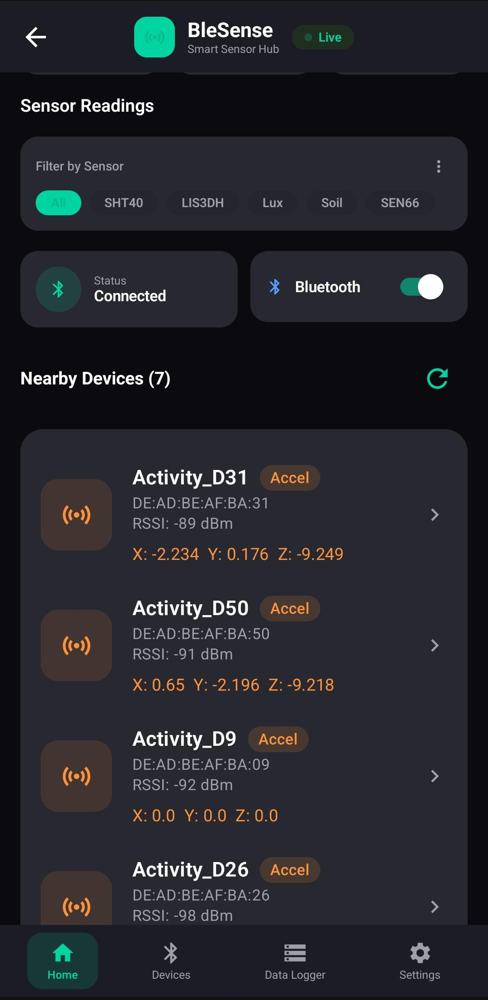
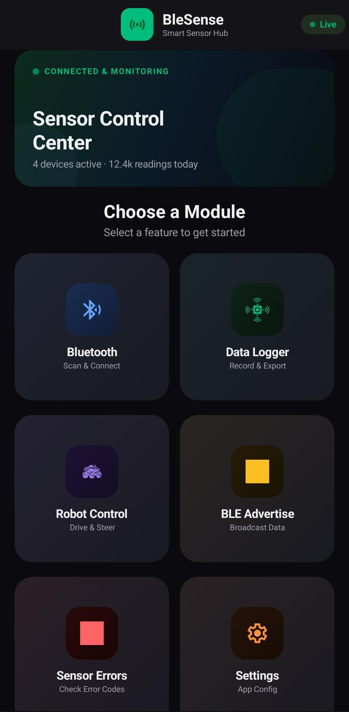
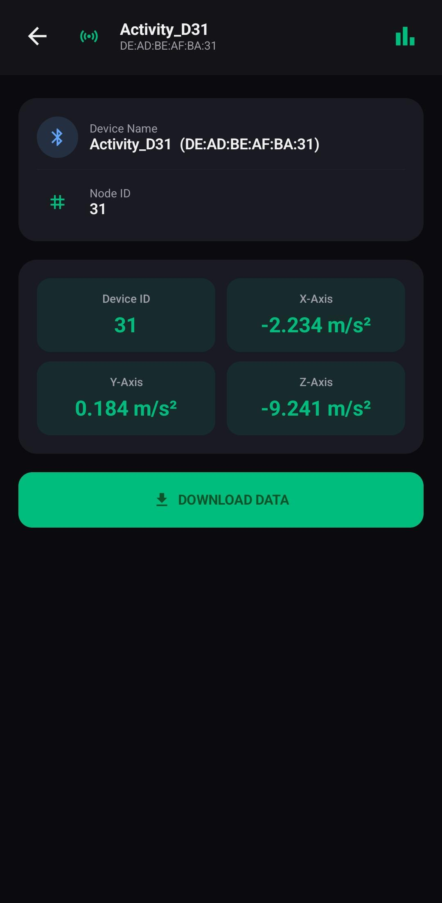
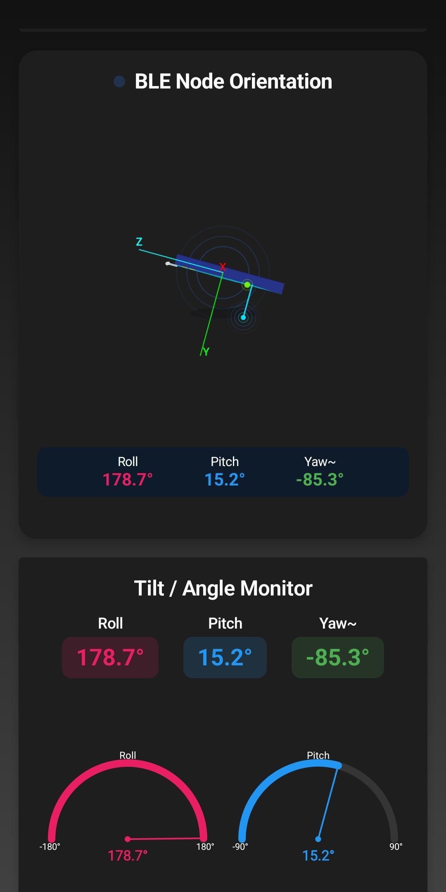
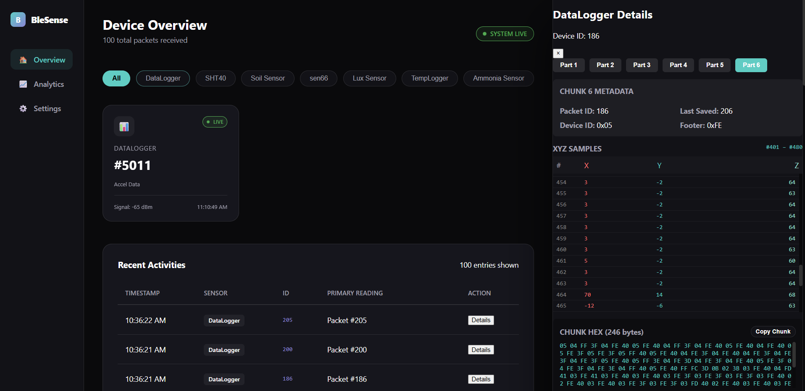

# BLE Sense Ecosystem

Welcome to the **BLE Sense Ecosystem**! This comprehensive project encompasses a unified environment for capturing, visualizing, and managing BLE sensor data through an Android application, a Web Dashboard, and related backend services.

## Features

- **Real-Time Data Logging:** Efficient BLE scanning and targeted sensor data extraction.
- **Dynamic Visualizations:** Live updates, animations, and interactive data representations.
- **Web Dashboard:** Comprehensive data aggregation and visualization on the web.
- **Cross-Platform Ecosystem:** Seamless integration across Android, Backend, and Web architectures.

## Application Screenshots

Here is a glimpse of the application interface and data dashboards:

### Android Application
<div align="center">
  
  
  
  
</div>

### Web Dashboard
<div align="center">
  
</div>

## Project Structure

- `app/` - The Android BLE Application source code.
- `web-dashboard/` - The web-based data visualization interface.
- `backend/` - Server-side components and data management.
- `portfolio/` - Developer portfolio showcasing this project.

## Installation

### Clone the Repository
```bash
git clone https://github.com/vishalkumar00699/Ble-Sense-Ecosystem.git
```

### Open in Android Studio
1. Open Android Studio
2. Click on **Open Project**
3. Select the project folder
4. Sync Gradle and Run

## Requirements
- Android Studio Hedgehog or later
- Android SDK 24+
- BLE Supported Android Device

## Developer
**Vishal Kumar**
